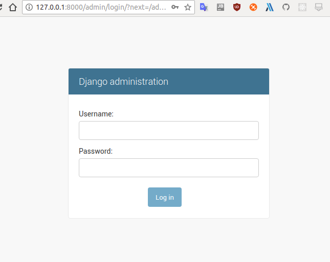
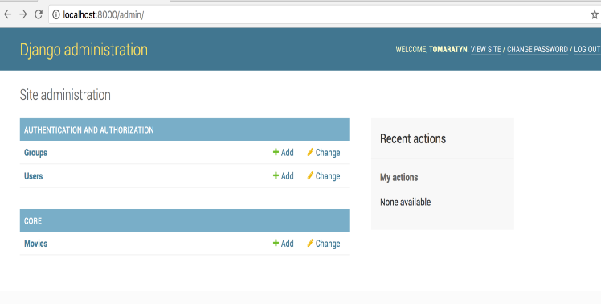
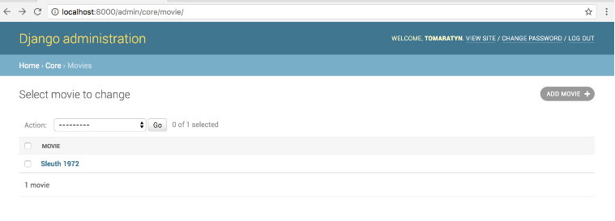
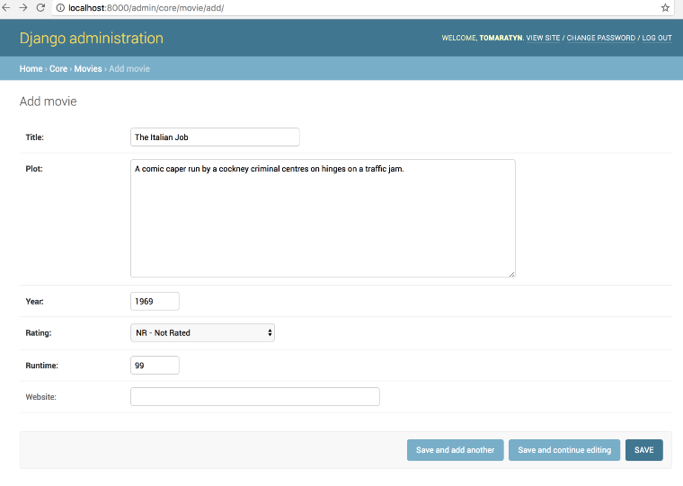
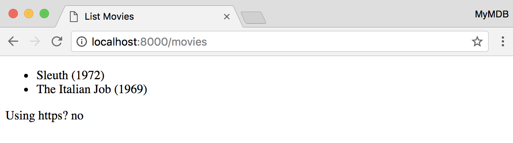
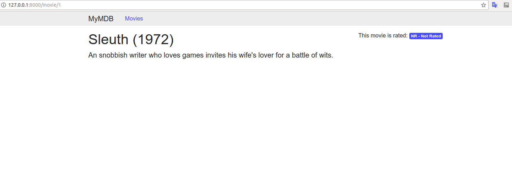
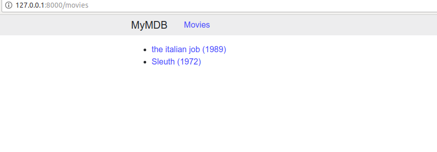
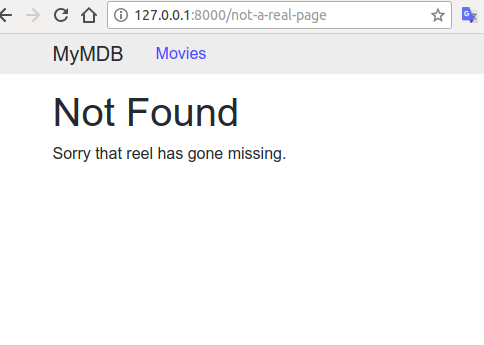

# Django初体验（一个电影评分网站）

[完整代码](https://github.com/fangchaooo/MDBWebsite)

## 如何查看代码：

clone代码后`git checkout 0.1.0`即可查看本章完整代码

## 项目介绍

- 做一个自己的MDB`Django`项目
- 使用`Django App`创建我们的第一个模型，视图，和模板
- 了解模型的使用，学会创建一对多，多对一等跨域关系创建

- **我们使用的环境是python3.6+， Django2.0， Ubuntu**

## 快速开始

### 工程创建

1. 创建一个文件夹

    ```shell
    $ mkdir MyMDB
    $ cd MyMDB
    ```
2. 创建python虚拟环境,请自行查询pipenv使用

    ```shell
    $ pip install pipenv
    $ pipenv --python 3.6
    $ pipenv shell
    ```
3. 在MyMDB文件夹中创建一个文件，命名为`requirements.dev.txt`,并写入
    ```txt
    django<2.1
    psycopg2<2.8
    ```
4. 确认你已进入pipenv shell，执行`pip install -r requeirements.dev.txt`。

5. 创建Django工程
    `django-admin startproject config`

6. 在MyMDB目录下：

    `mkdir django`
    `mv config django`

7. 成功后执行 `tree .`，显示如下：

    ```shell
    ├── django
    │   ├── config
    │   │   ├── __init__.py
    │   │   ├── settings.py
    │   │   ├── urls.py
    │   │   └── wsgi.py
    │   ├── manage.py
    ├── Pipfile
    ├── Pipfile.lock
    ├── requestment.dev.txt
    ```

### Django文件简介

- settings.py 
    django所有的环境设置
- urls.py
    django路由设置
- wsgi.py
    web服务网关接口是python和web服务器交互的接口。
- manage.py
    这是django的命令中心，你会一直用它。

### 了解数据库设置

使用`Django`大家常见的是用`sqlite`，但现在`postgresql`才是王道，所以我们也用它。

在settings.py中找到DATABASES，如：

```python
DATABASES = {
  'default': {
     'ENGINE': 'django.db.backends.sqlite3',
     'NAME': os.path.join(BASE_DIR, 'db.sqlite3'),
  }
}

# 将其更改为

DATABASES = {
    'default': {
        'ENGINE': 'django.db.backends.postgresql',
        'NAME': 'mymdb',
        'USER': 'mymdb',
        'PASSWORD': 'development',
        'HOST': '127.0.0.1',
        'PORT': '5432',
    }
}
```

## 核心App

Django app是遵循 **Model View Template（MTV)** 模式的。我们需要知道的是：

- Model： 负责保存和检索数据库中的数据
- Views： 负责处理HTTP请求，在模型上做请求、启动操作，还有返回HTTP响应
- Templates： 是相依外观的主体，也就是我们看见的网页结构

Django并不限制我们的app数量，所以我们可以创建无数我们需要的app。

### 创建core app

确定进入pipenv shell环境后（下文均是如此）操作

```
$ cd django
$ python manage.py startapp core
```

### 安装app

找到`django/config/seetings.py`
在`INSTALLED_APPS`下面添加：

```python
INSTALLED_APPS = [
    'core',
    'django.contrib.admin',
    'django.contrib.auth',
    'django.contrib.contenttypes',
    'django.contrib.sessions',
    'django.contrib.messages',
    'django.contrib.staticfiles',
]
```

### 添加第一个模型
进入`django/core/models.py`后添加：

```python
from django.db import models

class Movie(models.Model):
    NOT_RATED = 0
    RATED_G = 1
    RATED_PG = 2
    RATED_R = 3
    RATINGS = (
        (NOT_RATED, 'NR - Not Rated'),
        (RATED_G,
         'G - General Audiences'),
        (RATED_PG,
         'PG - Parental Guidance '
         'Suggested'),
        (RATED_R, 'R - Restricted'),
    )

    title = models.CharField(
        max_length=140)
    plot = models.TextField()
    year = models.PositiveIntegerField()
    rating = models.IntegerField(
        choices=RATINGS,
        default=NOT_RATED)
    runtime = \
        models.PositiveIntegerField()
    website = models.URLField(
        blank=True)

    def __str__(self):
        return '{} ({})'.format(
            self.title, self.year)
```
django模型是一个从Model派生出来的具有一个或多个的字段的类。在数据库中，model类类似于数据库，Field类对应于列，Model的实例对应于行。Django特有的ORM可以让我们直接使用django来操作数据库，而不是去写sql。

- RATINGS是常量数据，表示电影评级。
- title是电影名字，表示`varchar`列，长度为140.需要你填入最大长度
- plot是电影情节，`text`列，通常无最大长度
- year是电影年份，其代表`integer`列,django将在保存之前检查其是否为0或者更高
- rating是一个整数列，第一个参数是一个整数值，第二个是本地化版本。Django还会在我们模型中添加一个get_rating_display()的实例方法，该方法返回存储在我们模型中的值匹配的第二个元素。任何与选项中的值不匹配的值都会在保存时出现`VaildationError`。如果创建模型时未提供默认参数，则默认参数会提供默认值。
- runtime类似year
- website是一个保存URL的列，但实际上数据库中没有这个数据类型。URLField是一盒`varchar(200)`。URLField还附带验证，检查其值是否为有效的网络（`http / https / ftp / ftps`）URL。 admin应用程序使用空白参数来知道是否需要一个值（它不会影响数据库）。

`__str__`模块是帮助Django将模型转换为字符串的方法。

### 数据库迁移

在postgresql中创建数据库和用户

```sql
CREATE DATABASE mymdb;
CREATE USER mymdb;
GRANT ALL ON DATABASE mymdb to "mymdb";
ALTER USER mymdb PASSWORD 'development';
ALTER USER mymdb CREATEDB;
```

上述SQL语句将为我们的Django项目创建数据库和用户。 GRANT语句确保我们的mymdb用户可以访问数据库。 然后，我们在mymdb用户上设置密码（确保它与settings.py文件中的密码相同）。 最后，我们授予mymdb用户创建新数据库的权限，Django将在运行测试时使用这些数据库创建测试数据库。

然后执行

```shell
$ cd django
$ python manage.py makemigrations core
Migrations for 'core':
  core/migrations/0001_initial.py
    - Create model Movie

$ python manage.py migrate core 
Operations to perform:
  Apply all migrations: core
Running migrations:
  Applying core.0001_initial... OK

$ python manage.py dbshell
psql (9.6.1, server 9.6.3)
Type "help" for help.

mymdb=> \dt
             List of relations
 Schema |       Name        | Type  | Owner 
--------+-------------------+-------+-------
 public | core_movie        | table | mymdb
 public | django_migrations | table | mymdb
(2 rows)

mymdb=> \q


$ python manage.py migrate 
Operations to perform:
  Apply all migrations: admin, auth, contenttypes, core, sessions
Running migrations:
  Applying contenttypes.0001_initial... OK
  Applying auth.0001_initial... OK
  Applying admin.0001_initial... OK
  Applying admin.0002_logentry_remove_auto_add... OK
  Applying contenttypes.0002_remove_content_type_name... OK
  Applying auth.0002_alter_permission_name_max_length... OK
  Applying auth.0003_alter_user_email_max_length... OK
  Applying auth.0004_alter_user_username_opts... OK
  Applying auth.0005_alter_user_last_login_null... OK
  Applying auth.0006_require_contenttypes_0002... OK
  Applying auth.0007_alter_validators_add_error_messages... OK
  Applying auth.0008_alter_user_username_max_length... OK
  Applying sessions.0001_initial... OK
```

### 创建我们第一个电影

执行

```shell
$ cd django
$ python manage.py shell
Python 3.4.6 (default, Aug  4 2017, 15:21:32) 
[GCC 4.2.1 Compatible Apple LLVM 8.1.0 (clang-802.0.42)] on darwin
Type "help", "copyright", "credits" or "license" for more information.
(InteractiveConsole)
>>> from core.models import Movie
>>> sleuth = Movie.objects.create(
... title='Sleuth',
... plot='An snobbish writer who loves games'
... ' invites his wife\'s lover for a battle of wits.',
... year=1972,
... runtime=138,
... )
>>> sleuth.id
1
>>> sleuth.get_rating_display()
'NR - Not Rated'
```

- `objects`是模型的默认管理器。管理员是查询模型表格的界面。它还提供了用于创建和保存实例的create（）方法。每个模型必须至少有一个管理者，并且Django提供了一个默认管理。通常建议创建一个自定义管理器; 我们稍后会在添加人员和模型关系部分中看到。

- `id`是主键，Django自动创建

- `get_rating_display()`是Django添加的一种方法，因为评分字段有一个选择元组。 我们不必在我们的create()调用中提供评分，因为评分字段具有默认值（0）。get_rating_display()方法查找该值并返回相应的显示值。Django将为每个Field属性生成一个像这样的方法，并带有一个choices参数。

### 创建电影后台管理

Django有一个后台UI管理工具。
要让Django的admin app和模型一起工作，要有如下步骤：

1. 注册模型
2. 建立超级用户登录
3. 允许开发服务
4. 通过后台登录

现在我们在admin中注册Movie模型，打开`django/core/admin.py`

```python
from django.contrib import admin

from core.models import Movie

admin.site.register(Movie)
```

然后执行

```shell
$ cd django
$ python manage.py createsuperuser 
Username (leave blank to use 'tomaratyn'): 这里填你想注册的名字
Email address: 这里填邮箱
Password: 密码
Password (again): 密码
Superuser created successfully.


$ python manage.py runserver
Performing system checks...

System check identified no issues (0 silenced).
September 12, 2017 - 20:31:54
Django version 1.11.5, using settings 'config.settings'
Starting development server at http://127.0.0.1:8000/
Quit the server with CONTROL-C.
```

打开浏览器进入`http://127.0.0.1:8000/`，你将看到如下图



登录后按下图操作：


然后点击右上角ADD MOVIE


### 创建电影列表视图

在`django/core/views.py`中

```python
from django.views.generic import ListView

from core.models import Movie


class MovieList(ListView):
    model = Movie
```

`ListView`至少需要一个模型属性。它会查询模型中所有行，将其传递给模板，并在响应中返回呈现的模板。它还提供一些钩子，我们可以用它来代替默认行为，这些行为已经完全被记录。

`ListView`是如何知道去查询在`Movie`中所有对象？
每个模型都有一个默认管理器。Manager类主要用于通过提供返回`QuerySet`的方法(如`all()`)查询对象。ListView检查它是否具有模板属性，如果它存在，就知道模型类具有默认管理器，并且调用了`all()`方法。`ListView`还为我们提供了模板放置位置的惯例。如下：`<app_name>/<model_name>_list.html`

### 添加我们的第一个模板(movie_list.html)

Django有自己的模板语言。但也可以使用其他的，例如Jinja2。
我们在`django/core/templates/core/movie_list.html`来写第一个模板：

```html
<!DOCTYPE html>
<html>
  <body>
    <ul>
      
        <li>{{ movie }}</li>
      
        <li>
          No movies yet.
        </li>
      
    </ul>
    <p>
      Using https? 
      {{ request.is_secure|yesno }}
    </p>
  </body>
</html>
```

在[这里](https://docs.djangoproject.com/en/2.0/ref/templates/language/#filters)查看详细的python模板知识。

### 使用URLConf将路由请求返回到视图

现在我们有了模型、视图和模板，我们需要告诉Django哪一个请求将使用URLConf发送到我们的MovieList。每一个新项目都有一个根URLConf，`django/config/urls.py`,我们在我们的每个app中也创建一个路由，`django/core/urls.py`,输入：

```python
from django.urls import path

from . import views

app_name = 'core'
urlpatterns = [
    path('movies',
         views.MovieList.as_view(),
         name='MovieList'),
]
```

最基本的，`URLConf`是一个带有`urlpatterns`属性的模块，它是一个路径列表。路径由一个字符串组成，该字符串描述一个字符串，描述所讨论的路径和可调用的路径。CBV不可调用，所以基类`View`有一个返回可调用的静态`as_view()`方法。FBV可以作为回调传入（没有()运算符，它会执行它们）。

每个路径都应该被命名，这对于我们必须在模板中引用该路径时最有用。由于URLConf可以被另一个URLConf包含，我们可能不知道我们观点的完整路径。Django提供了一个reverse()函数和url模板标签，用于从名称到完整路径到视图。

app_name变量设置此URLConf所属的应用程序。通过这种方式，我们可以引用一个没有Django的命名路径，让其他具有相同名称路径的应用程序感到困惑（例如，index是一个非常常见的名称，所以我们可以说appA：index和appB：index来区分它们） 。

最后，我们来连接我们的`URLConf`到根目录的`URLConf`，更改`django/config/urls.py`.

```python
from django.urls import path, include
from django.contrib import admin

import core.urls

urlpatterns = [
    path('admin/', admin.site.urls),
    path('', include(
        core.urls, namespace='core')),
]
```

### 运行开发环境

```shell
$ cd django
$ python manage.py runserver
```

在浏览器中输入，`http://127.0.0.1:8000/movies`


看到上图，我们的第一个部分成功了。

## 个人电影页面

接下来快速创建新的电影信息页面。会议创建core app的过程，我举一反三：

1. 创建一个`MovieDetail`视图

2. 创建`movie_detail.html`模板

3. 添加视图路由

### 创建Detail视图

在`django/core/views.py`下写入：

```python
from django.views.generic import (
    ListView, DetailView,
)
from core.models import Movie

class MovieDetail(DetailView):
    model = Movie

class MovieList(ListView):
    model = Movie
```

`DetailView`要求`path()`对象在路径字符串中包含`pk`或`slug`，以便`DetailView`可以将该值传递给`QuerySet`以查询特定的模型实例。 一个`slu`是一个简短的`URL`友好标签，经常用于内容较重的网站，因为它是`SEO`友好的。

### 创建movie_detail.html模板

Django的模板语言支持模板继承，这意味着您可以为网站编写一个具有所有外观的模板，并标记其他模板将覆盖的块部分。 这使我们可以创建整个网站的外观，而无需编辑每个模板。 我们用它来创建一个包含MyMDB品牌和外观的基本模板，然后添加一个从基本模板继承的Movie Detail模板。

```shell
$ mkdir django/templates
```

在settings.py中更改：

```python
TEMPLATES = [
    {
        'BACKEND': 'django.template.backends.django.DjangoTemplates',
        'DIRS': [
            os.path.join(BASE_DIR, 'templates'),
        ],
        'APP_DIRS': True,
        'OPTIONS': {
            # omittted for brevity
        },
    },
]
```

`Django`中对模板的查找是从`BASED_DIR`开始递归查找每一个名字是`templates`的文件夹下的`HTML`文件。

在`django/templates/base.html`中写入：

```html
<!DOCTYPE html>
<html lang="en" >
<head >
  <meta charset="UTF-8" >
  <meta
    name="viewport"
    content="width=device-width, initial-scale=1, shrink-to-fit=no"
  >
  <link
    href="https://maxcdn.bootstrapcdn.com/bootstrap/4.0.0-beta/css/bootstrap.min.css"
    integrity="sha384-/Y6pD6FV/Vv2HJnA6t+vslU6fwYXjCFtcEpHbNJ0lyAFsXTsjBbfaDjzALeQsN6M"
    rel="stylesheet"
    crossorigin="anonymous"
  >
  <title >
    MyMDB
  </title>
  <style>
    .mymdb-masthead {
      background-color: #EEEEEE;
      margin-bottom: 1em;
    }
  </style>

</head >
<body >
<div class="mymdb-masthead">
  <div class="container">
    <nav class="nav">
      <div class="navbar-brand">MyMDB</div>
      <a
        class="nav-link"
        href=""
      >
        Movies
      </a>
    </nav>
  </div>
</div>

<div class="container">
  <div class="row">
    <div class="col-sm-8 mymdb-main">
     
    </div>
    <div
        class="col-sm-3 offset-sm-1 mymdb-sidebar"
    >
      
    </div>
  </div>
</div>

</body >
</html >
```

大多数HTML实际上是[bootstrap](https://getbootstrap.com/)的样板，但我们在其中添加了一些python标记。

`{％block title％} MyMDB {％endblock％}`：这会创建一个其他模板可以替换的块。 如果该块未被替换，则将使用来自父模板的内容。
`href =“{％ url 'core：MovieList' ％}“`：url标记将为指定的路径生成一个URL路径。 `URL`名称应该被引用为`<app_namespace>：<name>`; 在我们的例子中，`core`是核心应用程序的名称空间（per `django/core/urls.py`），`MovieList`是`MovieList`视图的`URL`的名称。

我们在`django/core/templates/core/movie_detail.html`中添加：

```html



  {{ object.title }} - {{ block.super }}



<h1>{{ object }}</h1>
<p class="lead">
{{ object.plot }}
</p>



<div>
This movie is rated:
  <span class="badge badge-primary">
  {{ object.get_rating_display }}
  </span>
</div>

```

这个模板中有很多`HTML`，因为`base.html`已经有了。 所有`MovieDetail.html`所要做的就是为`base.html`定义的块提供值。 我们来看看一些新的标签：

`{％extends'base.html'％}`：如果一个模板想要扩展另一个模板，第一行必须是一个扩展标签。 `Django`将查找基本模板（可以扩展另一个模板）并首先执行它，然后替换块。 扩展另一个模板的模板不能包含块以外的内容，因为它不明确放置该内容的位置。

`{{object.title}} - {{block.super}}`：我们引用`block.super`在`title`模板里面。block.super返回基本模板中标题模板块的内容。

`{{object.get_rating_display}}`：Django模板语言不使用`()`来执行该方法，只是通过名称引用它将执行该方法。

### 添加MovieDetail到core.urls.py

```python
from django.urls import path

from . import views

urlpatterns = [
    path('movies',
         views.MovieList.as_view(),
         name='MovieList'),
    path('movie/<int:pk>',
         views.MovieDetail.as_view(),
         name='MovieDetail'),
]
```

`python manage.py runserver`启动,显示如下




## 分页和链接电影列表到MovieDetail

### 更新MovieList.html去继承base.html

```html



All The Movies



<ul>
  
    <li>
      <a href="">
        {{ movie }}
      </a>
    </li>
  
  </ul>


```

我们也看到`url`标记与一个命名参数`pk`一起使用，因为`MovieDetail URL`需要一个`pk`参数。 如果没有提供参数，那么`Django`会在渲染时引发`NoReverseMatch`异常，导致`500`错误。

启动后如下图



### 设置order

现在的观点存在另一个问题，就是没有没有order,数据库会返回一个无序查询，那么分页导航将无用。更重要的，不能保证用户每次更改内容后当前页面会保持一致，因为数据库会返回不同顺序的结果。我们的查询需要有序。

使模型有序更容易开发。无论是用debug，还是写单元测试，或是使用shell，我们的模型都会以一致的顺序返回，可以使故障排除变得更简单。

一个Django模型可以选择一个名为Meta的内部类，它允许我们指定模型的信息，让我们添加一个带有排序属性的Meta类。

```python
class Movie(models.Model):
   # constants and fields omitted for brevity 

    class Meta:
        ordering = ('-year', 'title')

    def __str__(self):
        return '{} ({})'.format(
            self.title, self.year)
```

排序为一个字符串列表或者元组，其是字段名称组成，字符串可以选择以-表示降序的字符作为前缀。`('-year', 'title')`等价于 `ORDER BY year DESC, title`.

向模型的`Meta`类添加排序将意味着来自模型管理器的`QuerySets`将被排序。

### 添加分页

现在我们的电影总是以相同的方式排列，我们来添加分页。 Django ListView已经内置了对分页的支持，所以我们需要做的就是利用它。 分页由GET参数页面控制，该页面控制显示哪个页面。

现在在我们的`mian`模板部分下边添加分页

```html

 <ul >
    
      <li >
        <a href="" >
          {{ movie }}
        </a >
      </li >
    
  </ul >
  
    <nav >
      <ul class="pagination" >
        <li class="page-item" >
          <a
            href="?page=1"
            class="page-link"
          >
            First
          </a >
        </li >
        
          <li class="page-item" >
            <a
              href="?page={{ page_obj.previous_page_number }}"
              class="page-link"
            >
              {{ page_obj.previous_page_number }}
            </a >
          </li >
        
        <li class="page-item active" >
          <a
            href="?page={{ page_obj.number }}"
            class="page-link"
          >
            {{ page_obj.number }}
          </a >
        </li >
        
          <li class="page-item" >
            <a
              href="?page={{ page_obj.next_page_number }}"
              class="page-link"
            >
              {{ page_obj.next_page_number }}
            </a >
          </li >
        
        <li class="page-item" >
          <a
              href="?page=last"
              class="page-link"
          >
            Last
          </a >
        </li >
      </ul >
    </nav >
  

```

我们现在来看下其中终于的点：

- `page_obj`是一个`pag`类型，它知道关于这个页面结果的信息。我们用它来检查是否有使用`has_next()/ has_previous()`的下一个/上一个页面（我们不需要在Django模板语言中放置（），但`has_next（）`是一个方法而不是属性）。我们也使用它来获取`next_page_number（）/ previous_page_number（）`。请注意，在检索它们之前，使用`has _ *（）`方法检查下一个/上一个页码的存在非常重要。 如果它们在检索时不存在，则会引发`EmptyPage`异常。

- `object_list`继续可用并保存正确的值。 尽管`page_obj`在`page_obj.object_list`中封装了此页面的结果，但`ListView`确实可以继续使用`object_list`，并且我们的模板不会中断。

### 创建404页面

在`django/templates/404.html`

```html



Not Found



<h1>Not Found</h1>
<p>Sorry that reel has gone missing.</p>

```

目前，如果您有一个未使用的URL，例如`http://localhost：8000/not-a-real-page`，您将看不到我们的自定义404模板，因为Django的`DEBUG`设置在`settings.py`中为`True`。 要使我们的404模板可见，我们需要更改settings.py中的`DEBUG`和`ALLOWED_HOSTS`设置：

```python
DEBUG = False

ALLOWED_HOSTS = [
    'localhost',
    '127.0.0.1'
]
```

打开`http://127.0.0.1:8000/not-a-real-page`，显示如下:



### 测试我们的视图和模板

让我们添加一个执行以下功能的测试：

- 如果有超过10部电影，则应在模板中呈现分页控件
- 如果有超过10部电影，并且我们不提供页面GET参数，请考虑以下事项：

  - page_is_last上下文变量应该是False
  - page_is_first上下文变量应该为True
  - 分页中的第一项应标记为活动

在test.py中写入：

```python
from django.test import TestCase
from django.test.client import \
    RequestFactory
from django.urls.base import reverse

from core.models import Movie
from core.views import MovieList


class MovieListPaginationTestCase(TestCase):

    ACTIVE_PAGINATION_HTML = """
    <li class="page-item active">
      <a href="{}?page={}" class="page-link">{}</a>
    </li>
    """

    def setUp(self):
        for n in range(15):
            Movie.objects.create(
                title='Title {}'.format(n),
                year=1990 + n,
                runtime=100,
            )

    def testFirstPage(self):
        movie_list_path = reverse('core:MovieList')
        request = RequestFactory().get(path=movie_list_path)
        response = MovieList.as_view()(request)
        self.assertEqual(200, response.status_code)
        self.assertTrue(response.context_data['is_paginated'])
        self.assertInHTML(
            self.ACTIVE_PAGINATION_HTML.format(
                movie_list_path, 1, 1),
            response.rendered_content)
```

我们来看看其中有意思的点：

- `class MovieListPaginationTestCase(TestCase)`:`TestCase`是所有Django的基础测试集。它有许多内置的便利，包括更多的断言方法。

- `def setUp(self)`像大多的测试框架一样，Django的TestCase类也遵循测试启动和测试结束。数据库在每次测试之间进行清理，所以我们不必担心删除我们添加的任何模型。

- `def testFirstPage(self)`：一个方法是一个测试，只要其前缀有test。

- `Movie_list_path = reverse('core：MovieList')`：`reverse()`是之前提到的，并且是Django模板标签的Python等价物。 它会将名称解析为路径。

- `request = RequestFactory().get（path = movie_list_path）`：RequestFactory是创建假HTTP请求的便利工厂。 一个RequestFactory有一些简便的方法来创建GET，POST和PUT请求，方法是以动词（例如GET请求的get（））命名。 在我们的例子中，提供的路径对象并不重要，但其他视图可能需要检查请求的路径。

测试如下：

```shell
$ cd django
$ python manage.py test 
Creating test database for alias 'default'...
System check identified no issues (0 silenced).
.
----------------------------------------------------------------------
Ran 1 test in 0.035s

OK
Destroying test database for alias 'default'...
```

最后，我们已经可以确信我们的分页应用可以好好工作了。

## 添加人员和模型关系

在这一部分，我们将要添加关系模型到我们的项目。人们与电影的关系可以创建一个复杂的数据模型。同一个人可以是演员，作家和导演（例如，The Apostle(1997)的编写，导演，主演均是Robert Duvall）。即使忽略了人员与团队并简化一下，数据模型也将包含使用`ForiengKey`字段的一对多关系，使用`ManyToManyField`的多对多关系以及添加关于使用`ManyToManyField`中的`through`类实现多对多关系。

在者一部分，我们将如下一步步的操作：

  1. 创建`Person`模型
  2. 添加`ForeignKey`字段用以从`Movie`到`Person`去追踪导演
  3. 添加`ManyToManyField`从`Movie`到`Person`去追踪作家
  4. 添加`ManyToManyField`和`through`类去追踪哪些人表演以及他们的关系
  5. 创建数据库迁移
  6. 将导演，作者和演员添加到电影详情模板
  7. 将`PersonDetail`视图添加到列表中，该视图表示导演，作家，和表演者的

### 添加关系模型

```python
class Person(models.Model):
    first_name = models.CharField(
        max_length=140)
    last_name = models.CharField(
        max_length=140)
    born = models.DateField()
    died = models.DateField(null=True,
                            blank=True)

    class Meta:
        ordering = (
            'last_name', 'first_name')

    def __str__(self):
        if self.died:
            return '{}, {} ({}-{})'.format(
                self.last_name,
                self.first_name,
                self.born,
                self.died)
        return '{}, {} ({})'.format(
                self.last_name,
                self.first_name,
                self.born)
```

`DateField`用于跟踪基于日期的数据，在数据库中使用适当的列类型（Postgres上的日期）和Python中的`datetime.dat`e。 Django还提供了一个`DateTimeField`来存储日期和时间。

所有字段都支持`null`参数（默认为`False`），该参数指示列是否应接受`NULL`SQL值（由Python中的None表示）。 我们标记死亡为支持`NULL`，以便我们可以记录人们的生活或死亡。 然后，在__str __（）方法中，如果有人存活或死亡，我们会打印出不同的字符串表示形式。

### 不同类型的关系字段

Django的ORM支持使用中间模型映射模型之间关系的字段，包括一对多，多对多和多对多关系。

当两个模型具有一对多关系时，我们使用`ForeignKey`字段，该字段将在两个表之间创建具有外键（FK）约束（假设有数据库支持）的列。在没有`ForeignKey`字段的模型中，Django会自动添加一个`RelatedManager`对象作为实例属性。 `RelatedManager`类可以更轻松地查询关系中的对象。我们将在下面的章节中看看这个例子。

当两个模型具有多对多关系时，他们中的任一个（但不是两者）都可以获得`ManyToManyField（）`; Django将为您创建一个`RelatedManager`。如您所知，关系数据库实际上不能在两个表之间建立多对多的关系。相反，关系数据库要求每个相关表都带有外键的桥接表。假设我们不想添加任何描述关系的属性，Django会自动为我们创建并管理这个桥接表。

有时，我们需要额外的字段来描述多对多的关系（例如，何时开始或结束）;为此，我们可以提供带有`through`模型的`ManyToManyField`（有时称为UML / OO中的关联类）。这个模型将有一个`ForeignKey`到关系的每一边以及我们想要的任何额外字段。

我们将创建这些中的每一个的示例，因为我们将导演，作者和演员添加到我们的电影模型中。

#### 导演--ForeignKey

```python
class Movie(models.Model):
   # constants, methods, Meta class and other fields omitted for brevity.
    director = models.ForeignKey(
        to='Person',
        on_delete=models.SET_NULL,
        related_name='directed',
        null=True,
        blank=True)
```

- `to='Person`:Django的所有关系字段都可以接受字符串引用以及相关模型的引用。这个参数是必须的。
- `on_delete=model.SET_NULL`：Django需要得到当引用的模型被删掉时应该怎么做的指示。`SET_NULL`将把被删除的`Person`指向的所有`Movie`模型实例的director字段设置为`NULL`。 如果我们想要级联删除，我们将使用`models.CASCADE`对象。
- `related_name='directed`，这是一个可选参数，指示另一个模型上的RelatedManager实例的名称。这可以让我们查询一个Person定向的所有Movie模型实例）

这也是我们第一次为现有模型添加一个字段。这样做时，我们必须添加`null = True`或提供默认值。如果我们不这样做，那么`migrations`就会迫使我们去。这个要求的存在是因为Django必须假定在迁移运行时表中存在行（即使没有）。当数据库添加新列时，它需要知道它应该插入到现有行中。在director字段的情况下，我们可以接受它有时可能为NULL。

我们现在已经将一个字段添加到`Movie`中，并将一个新属性添加到`Person`实例，名为`directed`（`RelatedManager`类型）。 `RelatedManager`是一个非常有用的类，它类似于模型的默认管理器，但会自动管理两个模型之间的关系。

我们来看看`person.directed.create（）`并将其与`Movie.objects.create（）`进行比较。两种方法都会创建一个新电影，但是`person.directed.create（）`将确保新电影有人作为其导演。 `RelatedManager`还提供了添加和删除方法，以便我们可以通过调用`person.directed.add（movie）`将电影添加到指定的`Person`集。还有一个类似的`remove（）`方法，但从关系中删除了一个模型。

#### 作家--ManyToManyField

两模块也可能有多对多的关系，例如，一个人可能会写很多电影，而一部电影可能会被很多人写出。 接下来，我们将添加一个作家字段到我们的电影模型：

```python
class Movie(models.Model):
   # constants, methods, Meta class and other fields omitted for brevity.
    writers = models.ManyToManyField(
        to='Person',
        related_name='writing_credits',
        blank=True)
```

`ManyToManyField`建立了一个多对多的关系，并且像一个`RelatedManager`一样，允许用户查询和创建模型。 我们再次使用`related_name`来避免给Person一个`movie_set`属性，而是给它一个将成为`RelatedManager`的`writing_credits`属性。

在`ManyToManyField`的情况下，关系的两边都有`RelatedManager`，因此`person.writing_credits.add（movie）`与`movie.writers.add（person）`的效果相同。

#### 角色-ManyToManyField with a through class

当我们想要使用中介模型来描述两个其他模型之间的关系时，我们会看到关系字段的最后一个例子，该模型具有多对多的关系。 Django让我们通过创建一个模型来描述两个模型之间的多对多关系中的连接表。

在我们的案例中，我们将通过角色创建Movie和Person之间的多对多关系，该关系将具有name属性：

```python
class Movie(models.Model):
   # constants, methods, Meta class and other fields omitted for brevity.
    actors = models.ManyToManyField(
        to='Person',
        through='Role',
        related_name='acting_credits',
        blank=True)

class Role(models.Model):
    movie = models.ForeignKey(Movie, on_delete=models.DO_NOTHING)
    person = models.ForeignKey(Person, on_delete=models.DO_NOTHING)
    name = models.CharField(max_length=140)

    def __str__(self):
        return "{} {} {}".format(self.movie_id, self.person_id, self.name)

    class Meta:
        unique_together = ('movie',
                           'person',
                           'name')
```

这看起来像前面的`ManyToManyField`，除了我们有一个`to`（就像前面`Person`）和一个`through`（引用`Role`）参数。

`Role`模型看起来很像设计一个连接表;它对多对多关系的每一方都有一个`ForeignKey`。它还有一个名为`name`的额外字段来描述角色。

角色也有一个独特的约束。它要求电影，人物和计费都是唯一的;在`Meta`类的角色上设置`unique_together`属性将防止重复的数据。

`ManyToManyField`的这个用户将创建四个新的`RelatedManager`实例：

- `movie.actors`将作为`Person`的关联管理
- `person.acting_credits`将作为`Movie`的关联管理
- `movie.role_set`将作为`Role`的关联管理
- `person.role_set`将作为`Role`的关联管理

我们可以使用任何管理者查询模型，但只能查看`role_set`管理者，以创建模型或修改中间类的关系。 如果您尝试运行`movie.actors.add（person）`，Django将抛出IntegrityError异常，因为无法填充`Role.name`的值。 但是，您可以编写`movie.role_set.add（person = person，name ='Hamlet'）`。

#### 添加迁移

```shell
$ python manage.py makemigrations core
Migrations for 'core':
  core/migrations/0002_auto_20170926_1650.py
    - Create model Person
    - Create model Role
    - Change Meta options on movie
    - Add field movie to role
    - Add field person to role
    - Add field actors to movie
    - Add field director to movie
    - Add field writers to movie
    - Alter unique_together for role (1 constraint(s))

$ python manage.py migrate core
Operations to perform:
  Apply all migrations: core
Running migrations:
  Applying core.0002_auto_20170926_1651... OK
```

### 创建人员视图，更新电影列表

我们添加一个我们的`movie_detail.html`模板可以链接到的`PersonDetail`视图。 为了创造我们的视图，我们将通过四个步骤：

1. 创建一个管理器来限制数据库查询的数量
2. 创建我们的视图
3. 创建我们的模板
4. 创建一个引用我们视图的URL

#### 创建一个自定义管理器--PersonManager

我们的`PersonDetail`视图将列出一个`Person`正在表演，写作或导演的所有电影。在我们的模板中，我们将打印出每部电影中的每部电影的名称（以及演出的Role.name）。为了避免向数据库发送大量查询，我们将为我们的模型创建新的管理器，以返回更智能的`QuerySet`。

在Django中，只要我们在关系中访问一个属性，Django就会查询数据库以获取相关的项目（在每个项目上循环`person.role_set.all（）`，每个相关角色一个）。对于N部电影中的人员，这将导致对数据库进行N次查询。我们可以用`prefetch_related（）`方法避免这种情况（稍后我们将看看`select_related（）`方法）。使用`prefetch_related（）`方法，Django将在单个附加查询中查询单个关系中的所有相关数据。但是，如果我们不最终使用预取数据，查询它会浪费时间和内存。

让我们用一个新方法`all_with_prefetch_movies（）`创建一个PersonManager，并使其成为Person的默认管理器：

```python
class PersonManager(models.Manager):
    def all_with_prefetch_movies(self):
        qs = self.get_queryset()
        return qs.prefetch_related(
            'directed',
            'writing_credits',
            'role_set__movie')


class Person(models.Model):
    # fields omitted for brevity

    objects = PersonManager()

    class Meta:
        ordering = (
            'last_name', 'first_name')

    def __str__(self):
        # body omitted for brevity
```

我们的`PersonManager`仍然提供所有与默认相同的方法，因为`PersonManager`继承自`models.Manager`。我们还定义了一个新方法，它使用`get_queryset（）`来获取`QuerySet`，并告诉它预取相关模型。 `QuerySets`是懒惰的，所以直到查询集被评估为止（例如，迭代，投射到布尔，切片或由if语句评估），才会与数据库进行通信。在使用get（）通过PK获取模型之前，`DetailView`不会评估查询。

`prefetch_related（）`方法接受一个或多个查找，并在初始查询完成后自动查询这些相关模型。当您从QuerySet访问与某个模型相关的模型时，Django将不必查询它，因为您已经在`QuerySet`中预取了它。

查找是Django QuerySet用来表示模型中的字段或`RelatedManager`的内容。通过用两个下划线分隔关系字段（或`RelatedManager`）和相关模型字段的名称，查找甚至可以跨越关系：

```python
Movie.objects.all().filteractors__last_name='Freeman', actors__first_name='Morgan')
```

前面的调用将返回一个查询集，用于1Morgan Freeman1一直扮演演员的所有`Movie`模型实例。

在我们的`PersonManager`中，我们告诉Django预取一个Person已经执行，写入并且有角色的所有电影，以及预取它们自己的角色。 无论人员多么多产，使用`all_with_prefetch_movies（）`方法都会导致不断的查询次数。

#### 创建一个PersonDetail视图和模板

我们可以写一个非常精简的视图在`django/core/views.py`

```html
class PersonDetail(DetailView):
    queryset = Person.objects.all_with_prefetch_movies()
```

这个`DetailView`是不同的，因为我们没有提供它的模型属性。 相反，我们从`PersonManager`类中为它提供一个`QuerySet`对象。 当`DetailView`使用`QuerySet的filter（）`和`get（）`方法来检索模型实例时，`DetailView`将从模型实例的类名中派生出模板的名称，就像我们已经提供了模型类作为视图上的属性一样。

在`django/core/templates/core/person_detail.html`写入：

```html



  {{ object.first_name }}
  {{ object.last_name }}




  <h1>{{ object }}</h1>
  <h2>Actor</h2>
  <ul >
    
      <li >
        <a href="" >
          {{ role.movie }}
        </a >:
        {{ role.name }}
      </li >
    
  </ul >
  <h2>Writer</h2>
  <ul >
    
      <li >
        <a href="" >
          {{ movie }}
        </a >
      </li >
    
  </ul >
  <h2>Director</h2>
  <ul >
    
      <li >
        <a href="" >
          {{ movie }}
        </a >
      </li >
    
  </ul >


```

#### 创建MovieManager

```python
class MovieManager(models.Manager):

    def all_with_related_persons(self):
        qs = self.get_queryset()
        qs = qs.select_related(
            'director')
        qs = qs.prefetch_related(
            'writers', 'actors')
        return qs


class Movie(models.Model):
    # constants and fields omitted for brevity
    objects = MovieManager()

    class Meta:
        ordering = ('-year', 'title')

    def __str__(self):
         # method body omitted for brevity
```

`MovieManager`引入了另一种名为`select_related（）`的新方法。 `select_related（）`方法与`prefetch_related（）`方法非常相似，但在关系仅导致一个相关模型（例如，使用`ForeignKey`字段）时使用。 `select_related（）`方法通过使用JOIN SQL查询来检索一个查询中的两个模型。 当关系可能导致多个模型（例如，`ManyToManyField`或`RelatedManager`属性的任一侧）时，使用`prefetch_related（）`。

现在，我们可以更新我们的`MovieDetail`视图以直接使用查询集而不是模型：

```python
class MovieDetail(DetailView):
    queryset = (
        Movie.objects
            .all_with_related_persons())
```

该视图完全相同，但每次需要相关的Person模型实例时都不需要查询数据库，因为它们都是预取的。

## 总结

在本节中，我们创建了我们的Django项目并开始了我们的核心Django应用程序。我们看到了如何使用Django的模型 - 视图 - 模板方法来创建易于理解的代码。我们根据Django庞大模型，简洁视图和沉默模板的最佳实践创建了模型附近的集中数据库逻辑，视图中的分页和模板中的HTML。

现在我们已经准备好添加可以注册并对自己喜欢的电影进行投票的用户。

